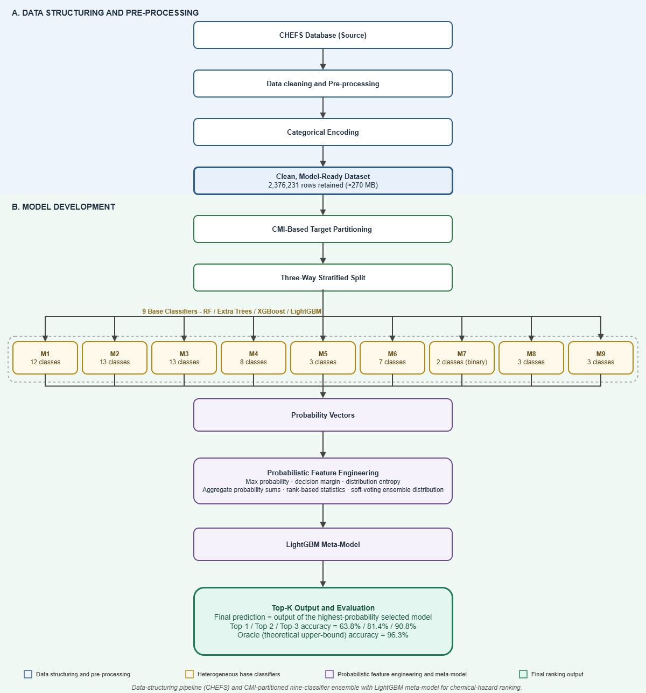

# Chemical Hazard Classification GUI

A lightweight desktop application for running single-sample inference with a trained
ensemble-of-classifiers + meta-model pipeline for chemical hazard classification in
food-safety data. Given the physico-chemical/sampling description of a single sample, the
tool predicts the top-3 most likely hazard classes (the `paramf` target column).

The pipeline consists of several base classifiers whose predictions are re-ranked by a
meta-model trained to estimate, for each sample, which base classifier is most likely to be
correct.

The full pipeline is illustrated below:


## Data source

The base classifiers and meta-model were trained on data from the **CompreHensive
European Food Safety (CHEFS) database**, which consolidates EFSA food safety monitoring
data (pesticide residues, veterinary medicinal product residues, and chemical
contaminants) into a single structured dataset:

> Kızılılsoley, N., van Meer, F., Mutlu, O., Hoenderdaal, W., Hobé, R., Mu, W., Gerssen, A.,
> van der Fels-Klerx, H.J., Jóźwiak, Á., Manikas, I., et al. (2026). Food safety trends
> across Europe: insights from the 392-million-entry CompreHensive European Food Safety
> (CHEFS) database. *Food Control*, *182*, 111816.
> [https://doi.org/10.1016/j.foodcont.2025.111816](https://doi.org/10.1016/j.foodcont.2025.111816)

If you use this tool or refer to the underlying data, please cite the paper above:

```bibtex
@article{kizililsoley2026food,
  title={Food safety trends across Europe: insights from the 392-million-entry CompreHensive European Food Safety (CHEFS) database},
  author={K{\i}z{\i}lilsoley, Nehir and van Meer, Floor and Mutlu, Osman and Hoenderdaal, Wouter and Hob{\'e}, Rosan and Mu, Wenjuan and Gerssen, Arjen and van der Fels-Klerx, HJ and J{\'o}{\'z}wiak, {\'A}kos and Manikas, Ioannis and others},
  journal={Food Control},
  volume={182},
  pages={111816},
  year={2026},
  publisher={Elsevier}
}
```
The official CHEFS database repository, including the scripts used to build it, is available at: https://github.com/WFSRDataScience/CHEFS

## Repository structure

Everything below is included in this repository, **except** the trained base models and
meta-model, which are distributed separately as a `models.zip` archive attached to a
[GitHub Release](https://github.com/Sarasidri/ML_test_algorithm_for_CHEFS/releases/tag/v1.0) due to their size, and must be
downloaded and unzipped before the first run (see [Installation](#installation)).

```
.
├── gui.py                  # Application entry point
├── requirements.txt
├── README.md
├── utils/
│   ├── io_utils.py          # Loading of models, encoders, and lookup tables
│   ├── encoding_utils.py    # Feature encoding / target decoding for a single row
│   ├── prediction_utils.py  # Base-model + meta-model inference pipeline
│   ├── autocomplete_utils.py
│   └── widgets.py           # Autocomplete Combobox widget
│
├── models/                    # NOT in the repo — download & unzip here (see Installation)
│   ├── model1.pkl ... modelN.pkl
│   ├── meta_model.pkl
│   └── meta_model_metadata.pkl
├── encoders/
│   ├── features_encoder.pkl
│   └── target_encoder.pkl
├── columns/
│   ├── <column_name>.txt     # one file per user-editable feature, for autocomplete
│   └── completion.csv        # productcomp -> (producttype, productspec) lookup table
└── data/
    └── test_meta_string.xlsx # sample of real rows used by the "Test real data" button
```

## Requirements

- Python 3.9 or later
- Tkinter (the GUI toolkit)

Tkinter is part of the Python standard library, but it is **not distributed via pip** — it
is tied to the Python interpreter itself, so it cannot be added through `requirements.txt`
or installed inside the virtual environment. It must already be available in the Python
installation you use to create the virtual environment:

- **Windows / macOS**, official installer from [python.org](https://www.python.org/downloads/):
  Tkinter is included by default — nothing to do.
- **Linux (Debian/Ubuntu)**: install the system package once, before creating the virtual
  environment:
  ```bash
  sudo apt-get install python3-tk
  ```
- **Linux (Fedora)**:
  ```bash
  sudo dnf install python3-tkinter
  ```

You can check whether Tkinter is already available at any time with:

```bash
python -m tkinter
```

If a small test window pops up, you're set; if it raises `ModuleNotFoundError`, install it
as shown above before continuing.

## Installation

These steps only need to be done **once**.

### 1. Clone the repository

```bash
git clone <repository-url>
cd <repository-folder>
```

> **Don't have Git installed?** On the repository's GitHub page, click the green **Code**
> button → **Download ZIP**, then extract it and open a terminal in that folder instead.
> Every step below works exactly the same either way — none of them depend on Git.

### 2. Create a virtual environment

```bash
python -m venv venv
```

### 3. Activate the virtual environment

- **Windows (PowerShell):**
  ```powershell
  venv\Scripts\Activate.ps1
  ```
- **Windows (cmd):**
  ```cmd
  venv\Scripts\activate.bat
  ```
- **macOS / Linux:**
  ```bash
  source venv/bin/activate
  ```

Your shell prompt should now be prefixed with `(venv)`.

### 4. Install the dependencies

```bash
pip install -r requirements.txt
```

### 5. Download and unzip the trained models

The trained models are not included in this repository due to their size (~1.5 GB); they
are distributed as a `models.zip` asset attached to a
[GitHub Release](https://github.com/Sarasidri/ML_test_algorithm_for_CHEFS/releases/tag/v1.0). Download it and
extract it into a `models/` folder next to `gui.py` — not flattened into the repository
root.
> For Windows users: Make sure to run this in **PowerShell**, not Command Prompt (cmd) — `Invoke-WebRequest` and `Expand-Archive` are PowerShell-only cmdlets. On Windows 10/11 you can open it by searching "PowerShell" in the Start menu, then navigate to the repository folder (the one containing `gui.py`) before running the commands below.

- **Windows (PowerShell):**
  ```powershell
  Invoke-WebRequest -Uri "https://github.com/Sarasidri/ML_test_algorithm_for_CHEFS/releases/download/v1.0/models.zip" -OutFile "models.zip"
  ```
  and then:
  ```powershell
  Expand-Archive -Path models.zip -DestinationPath models
  ```
- **macOS / Linux:**
  ```bash
  curl -L -o models.zip https://github.com/Sarasidri/ML_test_algorithm_for_CHEFS/releases/download/v1.0/models.zip
  ```
  and then:
  ```bash
  unzip models.zip -d models
  ```

Alternatively, download `models.zip` manually from the
[Releases page](https://github.com/Sarasidri/ML_test_algorithm_for_CHEFS/releases/tag/v1.0) and extract it yourself using
your OS's archive tool (in that case, on Windows, right-click the file and choose
"Extract All...", making sure the destination folder is named `models`).

Either way, you should end up with a `models/` folder next to `gui.py` containing the base
models, the meta-model, and its metadata directly inside it (e.g. `models/model1.pkl`, not
`models/models/model1.pkl`).

> **Note on version compatibility:** the files under `models/` and `encoders/` are Python
> objects saved with `joblib`/`pickle`. To avoid loading errors, make sure the
> `scikit-learn` and `lightgbm` versions installed in step 4 are the same major versions
> used to train the models (already pinned in `requirements.txt` if you generated it
> yourself after training; otherwise adjust the versions there to match).

## Running the GUI

### First run

After completing the installation steps above (venv created and activated, dependencies
installed, `models.zip` unzipped), launch the application with:

```bash
python gui.py
```

### Subsequent runs

Every time after the first, you only need to:

1. Activate the virtual environment (step 3 above).
2. Run the application:
   ```bash
   python gui.py
   ```

There is no build or compilation step — `gui.py` is a plain Python script that opens the
application window directly.

## Using the GUI

The window shows one field per model feature:

| Field           | Description                                                                                          | Behaviour in the GUI                                                |
|-----------------|-------------------------------------------------------------------------------------------------------|----------------------------------------------------------------------|
| `productcomp`   | Overall composition of the sampled product.                          | Free text with autocomplete; typing filters the suggestion list.    |
| `producttype`   | Raw material category to which the product belongs.                                                   | Read-only; filled in automatically from `productcomp` (see below).  |
| `samppoint`     | Point along the supply chain at which the sample was collected (e.g. farm, retail, border control).   | Free text with autocomplete.                                        |
| `labcountry`    | Country where the laboratory analysis was carried out.                                                | Free text with autocomplete.                                        |
| `origcountry`   | Country of origin of the product.                                                                      | Free text with autocomplete.                                        |
| `sampcountry`   | Country where the sample was collected.                                                                | Free text with autocomplete.                                        |
| `contamination` | For the given feature tuple, `no` denotes the most frequently *searched-for* contaminants, while `yes` denotes the most frequently *detected* ones. | Free text with autocomplete. |
| `productspec`   | Specification relating to that particular raw material (e.g. processing or cooking method).           | Read-only; filled in automatically from `productcomp` (see below).  |

As soon as a valid `productcomp` value is entered, `producttype` and `productspec` are
filled in automatically with the most frequent combination observed for that value in the
training data; these two fields cannot be edited directly.

### Buttons

- **Predict** — runs the full inference pipeline on the values currently entered in the
  form and displays the top-3 predicted `paramf` classes, ranked by confidence.
- **Test real data** — draws one random row from `data/test_meta_string.xlsx`, fills in the
  whole form with it, runs the same pipeline, and displays the top-3 predictions alongside
  the actual `paramf` value for that row, marking whether it was recovered within the
  top-3. Useful for a quick, qualitative sanity check of the model on genuine data. This
  button is disabled (shows an error message) if `data/test_meta_string.xlsx` is not present.

Predictions are shown in the "Top-3 predicted 'paramf'" panel at the bottom of the window,
ranked from most to least confident.

## Troubleshooting

- **`ModuleNotFoundError: No module named 'tkinter'`** — see [Requirements](#requirements):
  Tkinter must be installed at the system/Python level, it cannot be installed via `pip`.
- **"Unknown value" error on submit** — the value entered for a field was never observed
  while training the corresponding encoder, and therefore cannot be encoded. Check for
  typos or use the autocomplete suggestions.
- **Errors while loading files under `models/` or `encoders/`** — usually caused by a
  mismatch between the `scikit-learn`/`lightgbm` version used to train the models and the
  one installed in the virtual environment; see the note under Installation, step 5.
